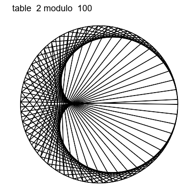
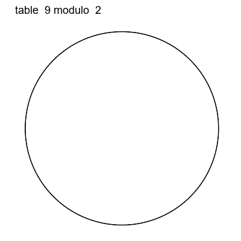

<!-- README.md is generated from README.Rmd. Please edit that file -->

```{r, echo = FALSE}
knitr::opts_chunk$set(
  collapse = TRUE,
  comment = "#>",
  fig.path = "README-"
)
```

[](https://cran.r-project.org/package=rusk)
[](https://cran.r-project.org/package=rusk)
[](https://travis-ci.org/ThinkR-open/rusk)
 [](https://ci.appveyor.com/project/ThinkR-open/rusk)
 [](https://codecov.io/github/ThinkR-open/rusk?branch=master)

# rusk

The goal of rusk is to show a nice representation of multiplication table


Explanations : 

[](http://www.youtube.com/embed/qhbuKbxJsk8?rel=0)[](http://www.youtube.com/embed/-X49VQgi86E?rel=0)


```{r, out.width = "400px",echo = FALSE}

```

```{r, out.width = "400px",echo = FALSE}

```
```{r, out.width = "400px",echo = FALSE}
knitr::include_graphics("inst/preview_t21.gif")
```


## Installation

You can install rusk from CRAN with:

```{r gh-installation, eval = FALSE}
# install.packages("devtools")
install.packages("rusk")
```

You can install rusk from github with:

```{r gh-installation, eval = FALSE}
# install.packages("devtools")
devtools::install_github("ThinkR-open/rusk")
```

## Example

### Using `draw` function
```{r example, message=FALSE, warning=FALSE}
library(rusk)
draw(table = 2, modulo = 10,label = TRUE)
draw(table = 2, modulo = 100)
draw(table = 2, modulo = 500)
draw(table = 7, modulo = 250)
draw(table = 21, modulo = 500)
```


### Using the shiny app
```{r eval=FALSE}
rusk::draw_app()
```

# TODO

allow decimal table
