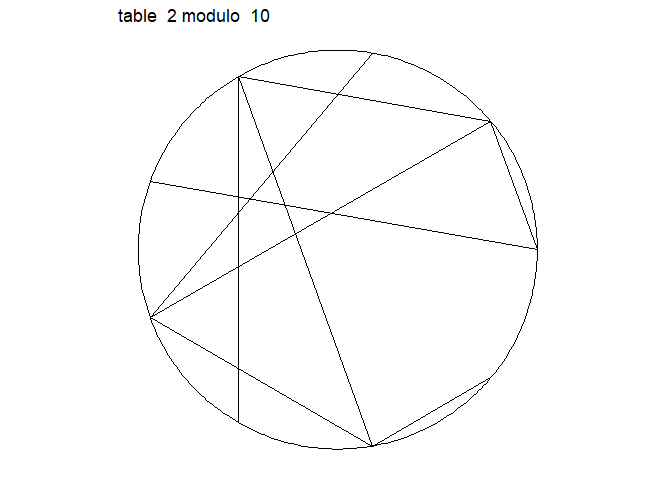
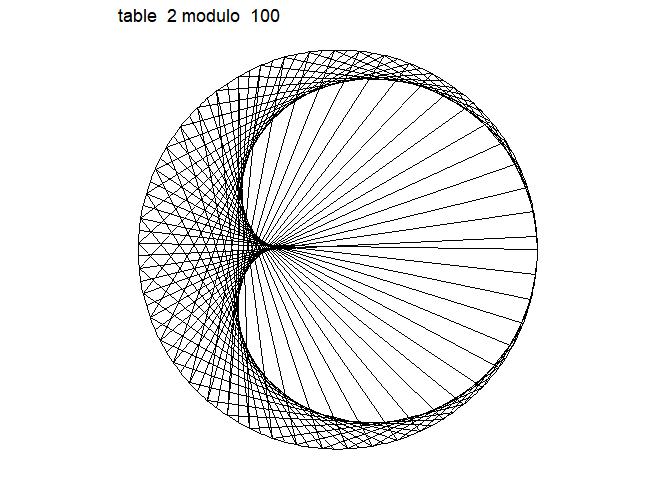
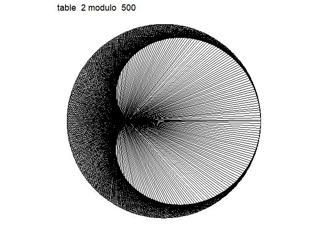
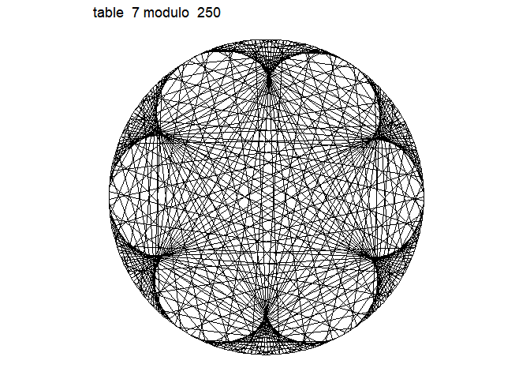
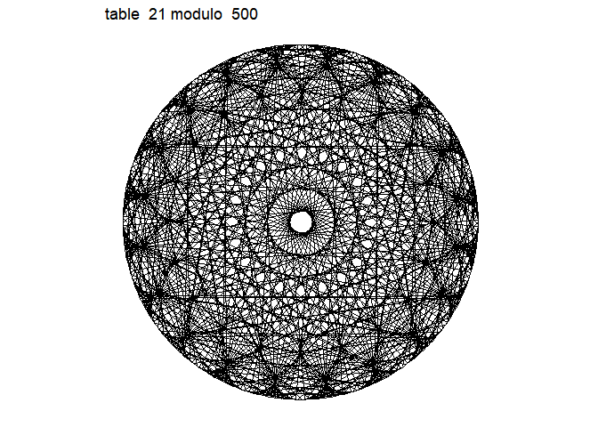

<!-- README.md is generated from README.Rmd. Please edit that file -->
rusk
====

The goal of rusk is to show a nice representation of multiplication table


 

Installation
------------

You can install rusk from github with:

``` r
# install.packages("devtools")
devtools::install_github("ThinkR-open/rusk")
```

Example
-------

### Using `draw` function

``` r
library(rusk)
draw(table = 2, modulo = 10,label = TRUE)
```



``` r
draw(table = 2, modulo = 100)
```



``` r
draw(table = 2, modulo = 500)
```



``` r
draw(table = 7, modulo = 250)
```



``` r
draw(table = 21, modulo = 500)
```



### Using the shiny app

``` r
rusk::draw_app()
```

TODO
====

allow decimal table
